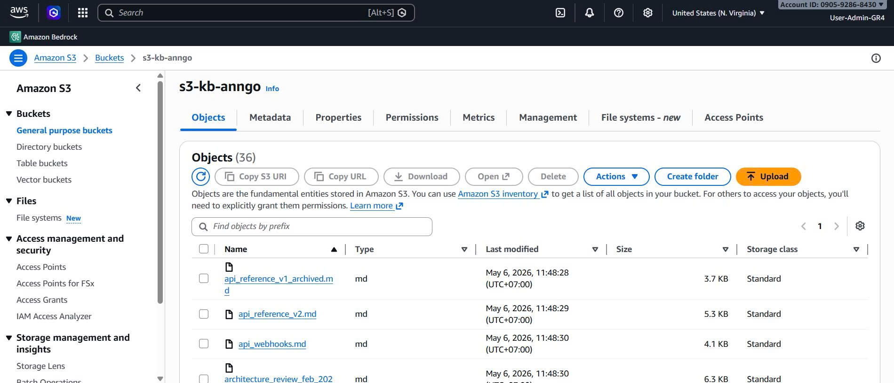
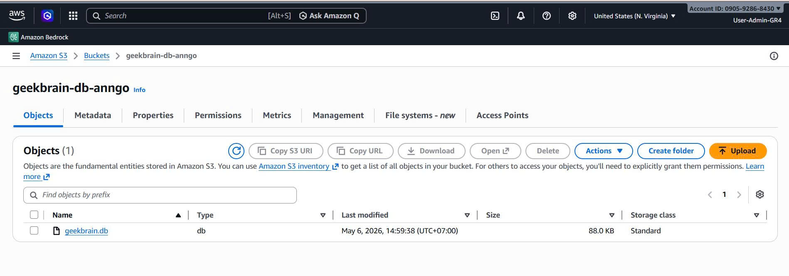

## Agent Core Bedrock

## L1
I. Tạo S3 và upload 36 file md
1. AWS Console -> S3 -> Create bucket.
2. Đặt tên bucket -> Create bucket
3. Mở bucket vừa tạo -> Upload -> chọn tât cả 36 file trong knowledge_base/ -> Upload.
Evidence:

II. Tao Bedrock Knowledge Base (KB)
1. AWS Console -> Amazon Bedrock
2. Ở thanh menu  -> Knowledge bases -> Create knowledge base.
3. chọn loại: Knowledge Base with vector store
4. Data source: S3 -> chon bucket vừa tạo ở bước I
5. IAM role: Create and use a new service role (wizard tạo role)
6. Embedding model: Amazon Titan Embeddings v2

7. Vector store: Amazon OpenSearch Serverless (managed by Bedrock) -> Create
Evidence:

III. Sync data source
1. Vào KB vừa tạo -> tab Data sources
2. Chọn data source rồi click Sync 
Evidence:

IV. Test retrieval (L1 readiness)
1. Vào KB rồi click Test Knowledge Base.
2. Chọn Retrieval and response generation: data sources and model
3. Chọn model Claude Sonnet 4.5

4. Đặt câu hỏi: "Who is the Team Platform lead?"
5. Kiểm Source chunks co team_platform.md.
6. Kiểm tra câu trả lời là: "Alex Chen"
7. Tiếp tục hỏi thêm 1 vài câu hỏi đại diện
Evidence:

----

----


## L2 Test conflict and multi-doc
1. Vào test Knowledge Base giống ở L1, kéo xuông phần Source -> Source chunks tăng từ 5 (để ở L1) tăng lên 9

2. Kéo xuống ở tab Configurations, phần Generation-> Generation prompt nhấn Edit rồi thêm nội dung như sau:

3. Ghi câu hỏi test conflict question: "What is PaymentGW's API rate limit?" — system phải retrieve cả v1 (500) lẫn v2 (1000) và xác định đúng v2 là current

----

4. Test với multi-doc question: "Can Team Commerce deploy on Friday night?" — system phải kết hợp deployment_policy.md + incident_response_policy.md + thông tin team

----

----


### L3 — Retrieval + Tools (Tool-Augmented RAG)
1. Seed Db:
1.1 Cài đặt Python về máy (nếu đã cái xong vào Power Shell sử dụng lệnh python --version -> ra được version VD: Python 3.14.4 là Ok)
1.2 mở terminal ở W4 cd vào phần scripts trong data_package
1.3 Tạo vene bằng lệnh: python -m venv .venv
                        .\.venv\Scripts\Activate.ps1
1.4 Cài deps từ pyproject.toml: pip install -U pip
                                pip install fastapi uvicorn psycopg2-binary pandas
1.5 Seed DB: python seed_data.py --db-type sqlite --sqlite-path geekbrain.db
uvicorn monitoring_api:app --port 8000

1.6 Có thể test 2 endpoint để xem API đã trả được dữ liệu chưa như sau: 
- http://127.0.0.1:8000/services

-  http://127.0.0.1:8000/metrics/PaymentGW


2. Tạo Lambda tools
2.1 Tạo Role cho Lambda
- Ở Console tìm và chọn IAM -> Role -> chọn Create role
- Trusted entity: AWS service
- Use case thì tìm và chọn Lambda -> Next
- Permissions: tìm vào tick AWSLambdaBasicExecutionRole -> Next
- Đặt tên Role name là gb-w4-lambda-role-an -> Create role

2.2 Thêm quyền tối thiểu
- Tạo 1 S3 bucket lưu riêng (geekbrain-db-anngo)
- Click vào role mới tạo, ở phần Permissions policies -> click Add permission -> Create inline policy
- Ở Policy editor chọn Json

2.3 Upload DB lên S3
- Vào S3 bucket geekbrain-db-anngo đã tạo trước đó vào upload file geekbrain.db

2.4 Tạo Lambda tool query_database
- Ở Console Tìm Lambda -> Create function
- Đặt tên Function (gb-query-database), chọn Runtime nên chọn cùng với phiên bản Python mình tải (3.14)
- click vào Additional settings, tick chọn Custom execution role -> Chọn role mà nãy đã tạo -> Save
- Create function
- Khi tạo xong click chọn tab Configuration -> Enviroment variables -> Edit và Add Environment variables với key và value như sau

- Quay lại phần code trong lambda và chỉnh sửa lại: 

import json
import os
import sqlite3
import boto3

s3 = boto3.client("s3")
DB_LOCAL_PATH = "/tmp/geekbrain.db"

def _download_db():
    bucket = os.environ["DB_BUCKET"]
    key = os.environ["DB_KEY"]
    s3.download_file(bucket, key, DB_LOCAL_PATH)

def _validate_sql(sql):
    sql_lower = sql.strip().lower()
    if not sql_lower.startswith("select"):
        raise ValueError("Only SELECT is allowed.")
    return sql

def lambda_handler(event, context):
    # Expect: {"sql": "..."}
    sql = event.get("sql")
    if not sql:
        return {"error": "Missing sql"}

    try:
        _validate_sql(sql)
        _download_db()

        conn = sqlite3.connect(DB_LOCAL_PATH)
        conn.row_factory = sqlite3.Row
        cur = conn.cursor()
        cur.execute(sql)
        rows = [dict(r) for r in cur.fetchall()]
        conn.close()

        return {"rows": rows}
    except Exception as exc:
        return {"error": str(exc)}

- sau đó nhấn Deploy
- Qua tab test thêm event: 
{"sql":"SELECT COUNT(*) as cnt FROM monthly_costs;"} -> Test 

->  Lambda gb-query-database chạy thành công, đã tải được geekbrain.db từ S3 và query được DB (COUNT = 36)

2.5 Tool 2: Service Metrics
- Cần phải URL public cho monitoring API -> sẽ sử dụng ngrok (nhanh không cần setup Ec2/lambda/API gateway , nhưng URL thay đổi khi restart; phụ thuộc máy local)
- Cài ngrok , mở ngrok sẽ có terminal mở ra
- gõ lệnh ngrok config add-authtoken YOUR_TOKEN (này kiếm ở acc mà đã tạo trên ngrok)
- gõ lệnh: ngrok http 8000 -> Ngrok sẽ chạy


- Vào Console -> lambda -> tạo 1 function tool thứ 2, với tên là gb-get-service-metrics và setup tương tự tool 1
- Vào tab Configuration -> Edit Enviroment variables:

- Quay lại phần code, thay vào đoạn code sau:

import json
import os
import urllib.request

def lambda_handler(event, context):
    service = event.get("service_name")
    if not service:
        return {"error": "Missing service_name"}

    base_url = os.environ["API_BASE_URL"].rstrip("/")
    url = f"{base_url}/metrics/{service}"

    try:
        with urllib.request.urlopen(url, timeout=10) as resp:
            data = json.loads(resp.read().decode("utf-8"))
        return {"metrics": data}
    except Exception as exc:
        return {"error": str(exc)}

-> Deploy, qua tab Test thay Event JSON vào: {"service_name":"PaymentGW"}


2.6 Tạo AgentCore Agent và Action Groups
1) Tạo Agent
- Ở Console -> Bedrock , tìm và chọn tab Agent ở thanh menu bên trái -> Create agent với tên là gb-agent-w4 -> created
- Ở phần Select model -> Chọn Claude Sonnet 4.5
- Gắn Knowledge Base đã tạo -> add (lưu ý hãy chọn Create and use a new service role từ trước và chọn model thì hãy nhấn Save rồi mới add được KB)
-> Save and exit
- Chọn test ở Agent vừa mới tạo -> prepared và test thử


2) Tạo Action Groups
- Chọn Edit in Agent Builder, ở phần Action groups -> Add
- Name: db_query , ở phần Action group invocation chọn Select an existing Lambda function và chọn Lambda Query (tool đã làm)
- Phần Action group function 1 -> chọn JSON Editor và sử dụng đoạn schema sau:
{
  "type": "object",
  "properties": {
    "sql": { "type": "string" }
  },
  "required": ["sql"]
}
-> Create
- Chọn tiếp Add Action group, nhập tên service_metrics
- Chọn lambda metrics đã tạo, Json Editor:
{
  "type": "object",
  "properties": {
    "service_name": { "type": "string" }
  },
  "required": ["service_name"]
}
-> Create

-> Save and Exit

3) Add permission trên Lambda
- Vào lần lượt 2 lambda đã tạo -> Configuration -> Permissions
- Kéo xuống phần Resource-based policy → Add permissions

----

----

4) Add permission ở Agent
- Vào lại phần giao diện Agent detail của mình, ở phần Agent overview -> Permissions -> vào IAM role của Agent
- Click vào Add permissions -> Create inline policy và chỉnh sửa policy editor (Json) như sau:

5) Chỉnh sửa Action groups - Thêm Parameters
- Vào Agent của mình, Click Edit in Agent Builder
- Click vào Action group db_query, kéo xuống phần Parameters -> Click Add parameters và Add như sau:
 
-> Save and Exit
- Tương tự vào Action group service_metrics -> Add parameters như sau:

-> Save and Exit
6) Cấu hình lại hàm lambda để tránh lỗi Missing parameter và chỉnh lại định dạng phản hồi
- Cập nhật code lambda_handler để duyệt qua mảng event['parameters'] nhằm lấy giá trị của service_name hoặc sql mà hình đã tạo ở action group, và chỉnh lại định dạng phản hồi cho Agent
- Code ở lambda get-service-metrics:
import json
import os
import urllib.request

def _agent_response(event, body_text):
    
    return {
        "response": {
            "actionGroup": event.get("actionGroup", ""),
            "function": event.get("function", ""),
            "functionResponse": {
                "responseBody": {
                    "TEXT": {
                        "body": body_text
                    }
                }
            }
        }
    }

def lambda_handler(event, context):
    # 1. Log event để debug trong CloudWatch (cần thiết cho Evidence Pack)
    print(f"Received event: {json.dumps(event)}")
    
    # 2. Trích xuất service_name từ danh sách parameters của Bedrock Agent[cite: 2]
    parameters = event.get("parameters", [])
    service = None
    for p in parameters:
        if p["name"] == "service_name":
            service = p["value"]
            break

    # Kiểm tra nếu không tìm thấy tham số service_name
    if not service:
        error_msg = "Error: Missing required parameter 'service_name'."
        print(error_msg)
        return _agent_response(event, json.dumps({"error": error_msg}))

    # 3. Lấy Base URL từ Environment Variable 
    base_url = os.environ.get("API_BASE_URL", "").rstrip("/")
    if not base_url:
        error_msg = "Error: Environment variable API_BASE_URL is not set."
        print(error_msg)
        return _agent_response(event, json.dumps({"error": error_msg}))

    url = f"{base_url}/metrics/{service}"
    print(f"Calling Monitoring API: {url}")

    # 4. Thực hiện gọi API thông qua ngrok
    try:
        req = urllib.request.Request(url)
        # Thêm timeout để tránh Lambda bị treo quá lâu
        with urllib.request.urlopen(req, timeout=10) as resp:
            status_code = resp.getcode()
            response_data = resp.read().decode("utf-8")
            data = json.loads(response_data)
            
            print(f"API Success (Status {status_code}): {response_data}")
            return _agent_response(event, json.dumps({"metrics": data}, ensure_ascii=False))
            
    except urllib.error.HTTPError as e:
        error_msg = f"HTTP Error: {e.code} - {e.reason}"
        print(error_msg)
        return _agent_response(event, json.dumps({"error": error_msg}))
    except Exception as exc:
        error_msg = f"Connection Error: {str(exc)}"
        print(error_msg)
        return _agent_response(event, json.dumps({"error": error_msg}))

- Code ở lambda query-database:
import json
import os
import sqlite3
import boto3

s3 = boto3.client("s3")
DB_LOCAL_PATH = "/tmp/geekbrain.db"

def _agent_response(event, body_text):
    return {
        "response": {
            "actionGroup": event.get("actionGroup", ""),
            "function": event.get("function", ""),
            "functionResponse": {
                "responseBody": {
                    "TEXT": {
                        "body": body_text
                    }
                }
            }
        }
    }

def _download_db():
    bucket = os.environ["DB_BUCKET"]
    key = os.environ["DB_KEY"]
    s3.download_file(bucket, key, DB_LOCAL_PATH)

def _validate_sql(sql):
    sql_lower = sql.strip().lower()
    if not sql_lower.startswith("select"):
        raise ValueError("Only SELECT is allowed.")
    return sql

def lambda_handler(event, context):
    # Log event để bạn có thể kiểm tra trong CloudWatch Logs
    print(f"Received event: {json.dumps(event)}")
    
    # --- CÁCH LẤY THAM SỐ ĐÚNG CHO BEDROCK AGENT ---
    parameters = event.get("parameters", [])
    sql = None
    for p in parameters:
        if p["name"] == "sql":
            sql = p["value"]
            break

    if not sql:
        return _agent_response(event, json.dumps({"error": "Missing sql parameter in 'parameters' list"}))

    try:
        # Làm sạch SQL (đôi khi AI bao quanh bằng markdown ```sql)
        sql = sql.replace('```sql', '').replace('```', '').strip()
        
        _validate_sql(sql)
        
        # Tối ưu: Chỉ download nếu file chưa có trong /tmp/
        if not os.path.exists(DB_LOCAL_PATH):
            _download_db()

        conn = sqlite3.connect(DB_LOCAL_PATH)
        conn.row_factory = sqlite3.Row
        cur = conn.cursor()
        
        print(f"Executing SQL: {sql}")
        cur.execute(sql)
        rows = [dict(r) for r in cur.fetchall()]
        conn.close()

        return _agent_response(event, json.dumps({"rows": rows}, ensure_ascii=False))
    except Exception as exc:
        print(f"Error executing query: {str(exc)}")
        return _agent_response(event, json.dumps({"error": str(exc)}))

7) Prepare lại Agent và test các Question L3
**Bổ sung**: chỉnh lại phần Instructions for the Agent để đảm bảo Agent sử dụng tool để xử lí như sau:
"You must use tools for data not in KB.
- For live metrics, always call service_metrics with service_name.
- For historical costs/SLA/incidents, always call db_query with SQL.
Known services: PaymentGW, AuthSvc, OrderSvc, NotificationSvc, ReportingSvc, FraudDetector.
Do not ask the user to confirm known service names.
Return the final answer after tool results."
- What is PaymentGW's current p99 latency? (Test tool: Service Metrics)

**Note:** hệ thống đang tiếp nhận một câu hỏi [What is PaymentGW's current p99 latency?],Căn cứ vào chuỗi văn bản thô này, Agent bắt đầu quá trình Xử lý ngôn ngữ tự nhiên (NLP) để tự động nhận diện ý định tra cứu (live metrics) và trích xuất chính xác thực thể (PaymentGW) nhằm làm tham số đầu vào cho việc gọi Tool ở bước tiếp theo.

**Note:** Agent ra quyết định và gọi công cụ (Tool Calling) của Agent sau khi hoàn tất quá trình phân tích ngữ nghĩa. Khối toolUse cho thấy thay vì cố gắng tự trả lời, AI đã chủ động chọn đúng hàm service_metrics và tự động định dạng tham số trích xuất được thành cấu trúc JSON chuẩn {"service_name":"PaymentGW"}.

**Note:** Nó nhìn lại toàn bộ quá trình (câu hỏi + dữ liệu thô mà API vừa trả về), sau đó tự động lọc bỏ các chỉ số thừa để trích xuất đúng con số 186ms, chuẩn bị cho việc viết câu trả lời cuối cùng.

**Note:** Agent đang "Viết báo cáo tổng kết". Nó lấy số liệu đã lọc được, lắp vào một câu hoàn chỉnh đúng form quy định, rồi chính thức đóng luồng xử lý lại
----
- What was GeekBrain's total infrastructure cost across all services in Q1 2026? (Test tool: Database Query)

**Note:** hệ thống đang tiếp nhận một câu hỏi [What was GeekBrain's total infrastructure cost across all services in Q1 2026?]

**Note:** AI đã quyết định gọi công cụ db_query. Agent đã tự động bóc tách các yêu cầu 'total cost', 'Q1' và '2026', sau đó biên dịch chúng thành một câu lệnh SQL hoàn chỉnh, chuẩn cú pháp (SELECT SUM(cost) as total_cost FROM costs WHERE quarter = 'Q1' AND year = 2026). rồi bấm nút gọi Tool để truy cập vào Database lấy số liệu


- Is NotificationSvc currently meeting its SLA targets? (Test tool: Service Metrics + Database Query)


-----
Log tool Cloud Watch:
- CW tool Service Metrics:


- CW tool Database Query:


